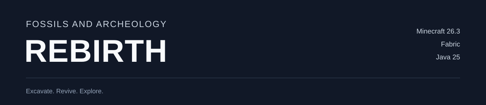

<div align="center">



**Bring prehistory back to Minecraft.**

Minecraft **26.3** · **Fabric** · Java **25** · Version **0.0.1**

[Installation](#installation) · [Play guide](docs/PLAY_GUIDE.md) · [Build from source](#build-from-source) · [Report a bug](https://github.com/gemdYT/FossilsArcheologyRebirth/issues)

</div>

---

Uncover fossils, recover ancient DNA, and raise prehistoric animals. Restore forgotten artifacts, build a museum, and explore ruins and volcanic terrain.

Rebirth is a Fabric mod with its own development direction: lively animals, a complete archaeology progression, and a focused codebase maintained on **`main`**.

## A prehistoric world to build

| Discover | What you can do |
| :--- | :--- |
| 🦖 **64 prehistoric species** | Raise land animals, flying creatures and aquatic life with species movement speeds, hunting, fleeing, care and ownership. |
| ⛏️ **Fossil excavation** | Mine fossil deposits and amber, sift sand and gravel, and analyze your discoveries for DNA and plant finds. |
| 🧬 **Bring animals to life** | Culture DNA with Bio-Goo, incubate eggs or embryos, and feed, tame and care for the animals you raise. |
| 🏺 **Archaeology and exploration** | Restore relics and equipment, discover ruins and temples, visit village buildings, and progress through the Anu encounter and treasury. |
| 🦴 **Your own museum** | Assemble skeletons from matching bone groups, choose display poses, and consult the dinopedia. |
| ⚙️ **Five machines** | Use the Analyzer, Culture Vat, Sifter, Worktable and Feeder, with hopper automation and optional energy support. |
| 🌋 **Ancient landscapes** | Explore volcanic terrain and prehistoric trees and plants, with 250 catalog blocks and 879 catalog items. |

### Start your first expedition

**Excavate → Analyze → Culture → Incubate → Care → Explore**

Start with fossil-bearing stone or a Sifter. Analyze biological finds, culture the recovered DNA, then place the resulting egg or embryo in a suitable habitat. Build enclosures, care for your animals, and turn your discoveries into a museum.

The [play guide](docs/PLAY_GUIDE.md) covers recipes, animal commands, incubation, exhibits, exploration and progression.

## Installation

1. Use **Minecraft 26.3**, **Java 25**, and **Fabric Loader 0.19.5 or newer**.
2. Download the **0.0.1 install kit** from [GitHub Releases](https://github.com/gemdYT/FossilsArcheologyRebirth/releases). Extract the kit and copy its **six jars** from `mods/` into your instance's `mods/` folder. You can also create the kit using the build steps below.
3. Remove the previous Rebirth mod jar and restart Minecraft.

If you download the standalone mod jar instead, install these Fabric libraries alongside it:

| Library | Version |
| :--- | :--- |
| Fabric API | 0.161.0+26.3 |
| GeckoLib | 5.5.7 |
| TerraBlender | 26.3.0.0.9 |
| SmartBrainLib | 2.0.2 |
| Structure Pool API | 1.3.0+26.3-fabric |

Team Reborn Energy **5.0.0** is bundled inside the mod jar.

**Current status:** 0.0.1 is the first Rebirth release, starting a new version sequence for the Fabric port. Representative movement, animation, hunting, machines and progression have been checked. Broad species balance, long-session stability, modpack compatibility and dedicated-server gameplay still need testing. See the [testing notes](docs/PLAY_GUIDE.md#testing-and-simplified-behavior).

Minecraft 26.3 is the verified target. Future Minecraft versions will need their own compatibility checks.

## Build from source

Install a **Java 25 JDK** and clone the maintained branch:

```shell
git clone --branch main https://github.com/gemdYT/FossilsArcheologyRebirth.git
cd FossilsArcheologyRebirth
```

On Windows:

```powershell
.\gradlew.bat build
.\gradlew.bat runClient
```

On Linux or macOS:

```shell
./gradlew build
./gradlew runClient
```

Build output is in `build/libs/`. Windows users can also launch the development client with `launch-game.cmd`.

To create the install kit after a successful build, use Python:

```shell
python tools/package_build.py
```

Release files appear in `dist/`: the standalone mod jar, an `-install-kit.zip` containing the mod and its five external libraries, and `SHA256SUMS-0.0.1.txt`. The kit includes the play guide, credits and a checksum manifest. [Release notes](docs/releases/0.0.1.md) are ready to use when publishing the GitHub release with tag `v0.0.1`.

For development checks, run `build`, `runClientGameTest`, and `python tools/audit_content.py`. The [architecture guide](docs/ARCHITECTURE.md) explains profiles, recipes, libraries and maintenance.

## Active developer

**[gemdYT](https://github.com/gemdYT)** — creator and maintainer of Fossils and Archeology Rebirth.

Development happens on **`main`**. Report bugs or suggest improvements through this repository's [issues](https://github.com/gemdYT/FossilsArcheologyRebirth/issues). Include the mod version, Minecraft version, reproduction steps and relevant logs.

## License

Code is licensed under **MIT**. Original assets retain their stated **All Rights Reserved** terms. See [LICENSE](LICENSE) and the credits below.

---

## Original mod credits

<details>
<summary><strong>Expand the original developers and contributor credits</strong></summary>

Rebirth builds on work contributed by TeamFossilsArcheology and the original mod community.

**Original developers:** DarkPred, Shadowbeast007, Microjunk, 4f6f3b, Totara, Cannibal Vox, Roomon1, JTGhawk137, Alexthe666, iLexiconn, gegy1000 and tmvkrpxl0.

The complete historical developer, artist, animator, audio, builder and translator lists are in the separate [original mod credits](docs/CREDITS.md). Additional translation attribution is preserved in [ORIGINAL_CONTRIBUTORS.txt](docs/ORIGINAL_CONTRIBUTORS.txt).

Special thanks to Flammarilva, Team July and the early Fossils mod team.

</details>
